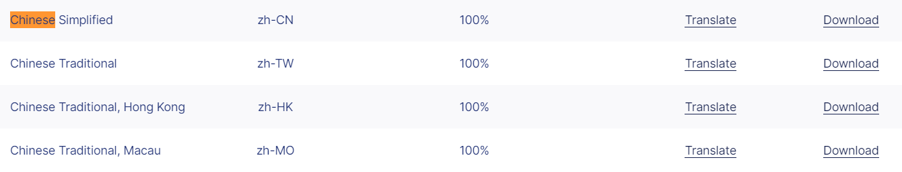

# vue 整合 tinymce

## 快速安装

```bash
npm install @tinymce/tinymce-vue@3.2.8 -S	// vue2 中不能使用 @tinymce/tinymce-vue 为4以上的版本
npm install tinymce@5.10.3 -S
```

上述安装后，编辑器默认是英文，因此若有需要可以下载[中文汉化包](https://www.tiny.cloud/get-tiny/language-packages/)



之后在 vue 项目的 static 或 public 目录下创建 tinymce 目录，该目录用以存放主题、语言包以及后面可能需要使用到的自定义插件。将 node_modules/tinymce 目录下的 `skin` 、`plugin` 文件夹 复制到 public/tinymce 中，并可在 public/tinymce 目录下创建 langs 目录用以安装语言包。

> 当然，你也可以直接选择其他已经打包好的 tinymce 置于 public 目录，比如使用 vue-element-admin 打包好的 tinymce，这类情况下需要将 @tinymce/tinymce-vue 中的 min.js 文件也一并复制到 public/tinymce 目录下，而不需要在 package.json 文件中写入 tinymce 的依赖
>
> 之后在 public/index.html 文件中引入 tinymce：

```html
<html>
  <head>
    ...
    <script src="<%= BASE_URL %>tinymce4.7.5/tinymce.min.js"></script>
    <script src="<%= BASE_URL %>tinymce4.7.5/langs/zh_CN.js"></script>
  </head>
```

## 封装 tinymce 为组件

