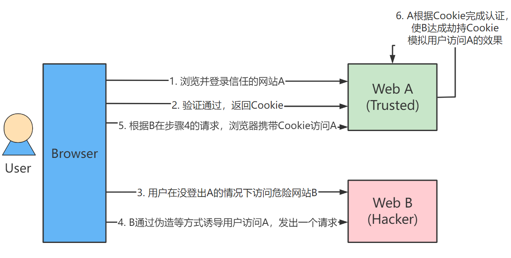

# Spring Security Note

# 简介

一般用于中大型项目的安全框架，相比起**shiro**，Spring Security提供更丰富的功能与社区资源

## 认证与授权

一般Web应用需要进行认证和授权

* 认证：验证当前访问系统的是否为本系统的用户，具体又是哪个用户

* 授权：经过认证后判断该用户拥有什么权限进行什么操作

## 基本原理

Spring Security本质上是一条过滤器链，其底层主要有三个过滤器


### FilterSecurityInterceptor

方法级的权限校验过滤器，基本位于过滤器链的最底部

### ExceptionTranslationFilter

异常过滤器，用来处理在认证授权过程中抛出的任何AccessDeniedException和AuthenticationException异常

### UsernamePasswordAuthenticationFilter

对/login的POST请求做拦截，校验表单中的用户名和密码

## 快速开始

为模块引入如下依赖

```yml
<dependencies>
  <dependency>
    <groupId>org.springframework.boot</groupId>
    <artifactId>spring-boot-starter-web</artifactId>
  </dependency>
  <dependency>
    <groupId>org.projectlombok</groupId>
    <artifactId>lombok</artifactId>
    <optional>true</optional>
  </dependency>
  <!-- Spring Security -->
  <dependency>
    <groupId>org.springframework.boot</groupId>
    <artifactId>spring-boot-starter-security</artifactId>
  </dependency>
</dependencies>
```

引入后Spring Security将自带认证及其默认认证账户 `user` ，为资源访问添加一个认证界面(可用户自定义)并在控制台中输出临时的用户密码

```
Using generated security password: 531d7c71-7435-4d38-ac4b-d678eae86498
```

## 认证

### 现代前后端分离项目认证流程


### 自定义逻辑过程

结合上文提到的基本原理，自定义认证的逻辑可以如下：

* 创建一个类继承 `UsernamePasswordAuthenticationFilter` 并重写3个方法

* 实现 `UserDetailsService` 并注入容器，Spring Security会自动使用该实现作为新的 `UserDetailsService`
  ，当然也可以在config类中指定使用的 `UserDetailsService` ；实现类中可编写查询数据库与授权等过程，最终返回安全框架提供的 `UserDetails` 对象（该对象可以通过编写实现类对已有的 `User`
  实体进行封装）

* 实现 `PasswordEncoder` 接口对密码进行加密，官方推荐使用 `BCryptPasswordEncoder`
  实现类来进行加密，该实现类是BCrypt强散列方法的具体实现，是基于哈希算法实现的单向加密，可以通过 `strength` 来控制加密强度，默认为10

## 授权

不同的用户可以使用不同的功能

不能只依赖前端来判断用户的权限来选择显示哪些菜单哪些按钮，如果只是这样，一旦有人知道了对应功能的接口地址就可以不通过前端而直接发送请求去实现相关功能的操作，因此需要在后端进行用户权限的判断，判断当前用户是否有响应的权限，必须具有所需权限才能进行响应操作。

### 授权基本流程

在Spring
Security中会使用默认的FilterSecurityInterceptor来进行权限校验。在FilterSecurityInterceptor中会从SecurityContextHolder获取其中的Authentication，然后获取其中的权限信息来确定当前用户是否拥有访问当前资源所需的权限。

因此为项目添加权限操作只需要把当前登录用户的权限也存入Authentication，然后为资源设置所需权限即可。

### 授权实现

#### 限制访问资源所需权限

Spring Security提供了基于注解的权限控制方案，也是主要采用的授权方式

```java
@EnableGlobalMethodSecurity(prePostEnabled = true)  // 开启配置
```

使用对应注解 `@PreAuthorize`

#### 从数据库中查询权限信息

##### RBAC权限模型

RBAC（Role-Based Access Control）即：基于角色的权限控制，这是目前最常被开发者使用也是相对易用、通用的权限模型


> 关联表建议使用多主键

该权限模型的注意力集中于用户、角色、权限三个实体，其中用户-角色和角色-权限均为多对多关系，因此为避免数据冗余另起数据表分隔

查询一个角色有哪些权限时，SQL语句如下：

```sql
SELECT DISTINCT m.perms
FROM sys_user_role ur
         LEFT JOIN sys_role r ON ur.role_id = r.id
         LEFT JOIN sys_role_menu rm ON ur.role_id = rm.role_id
         LEFT JOIN sys_menu m ON m.id = rm.menu_id
WHERE user_id = 3
  AND r.status = 0
  AND m.status = 0
```

## 自定义失败处理

若希望在认证失败或授权失败时也能和定义好的ResponseResult一样返回相同结构的json，从而让前端能对响应进行统一的处理，就需要在了解Spring Security的异常处理机制后作自定义失败处理

在Spring Security中，若认证或授权的过程中出现了异常，会被ExceptionTranslationFilter捕获到，并在其中判断是认证失败还是授权失败出现的异常。

如果是认证过程中出现的异常会被封装成AuthenticationException然后调用AuthenticationEntryPoint对象的方法去进行异常处理。

如果是授权过程中出现的异常会被封装成AccessDeniedException然后调用AccessDeniedHandler对象的方法去进行异常处理。

因此若要自定义失败处理，只需自定义AuthenticationEntryPoint和AccessDeniedHandler然后配置给SpringSecurity即可。

## 跨域问题

### CORS简介

CORS（Cross-Origin Resource Sharing，跨域资源共享），介绍此概念前需要先介绍**域**、**资源**、**同域策略**三个概念：

* 域：指**一个站点**，域由 protocol、host 和 port 三部分组成，其中 host 可以是域名，也可以是 ip ; port 如果没有指明，则是使用 protocol 的默认端口
* 资源：指一个 URL 对应的内容
* 同域策略：为了防止 XSS（Cross-site
  scripting，跨站脚本攻击：利用安全漏洞将代码注入到网站上使得用户加载网页时执行攻击者恶意制造的网页程序），浏览器、客户端应该仅请求与当前页面来自同一个域的资源，请求其他域的资源需要通过认证

由于同域策略的影响，从站点A请求站点B的资源时，这样的跨域请求将被禁止发送；为了让跨域请求能够正常发送，我们需要一套机制在不破坏同域策略安全性的情况下允许跨域请求正常发送，这样的机制就是 CORS

#### 预检请求

在 CORS 中，定义了一种预检请求（preflight request），当实际请求不是一个**简单请求**时，会发起一次预检请求。预检请求是针对实际请求的 URL 发起一次 OPTIONS 请求，并带上下面三个 headers：

* Origin：当前页面所在的域，用于告诉服务器当前请求的域。如果没有这个header，服务器将不会进行CORS验证
* Access-Control-Request-Method：实际请求将会使用的方法
* Access-Control-Request-Headers：实际请求将会使用到的 header 集合

如果服务端 CORS 验证失败，则会返回客户端错误，即 4xx 的状态码；否则，将会返回成功，返回 200 的状态码，并携带以下 headers：

* Access-Control-Allow-Origin：允许请求的域，多数情况下就是预检请求中的 Origin 的值
* Access-Control-Allow-Credentials：一个布尔值，表示服务器是否允许使用 cookies
* Access-Control-Expose-Headers：实际请求中可以出现在响应中的 headers 集合
* Access-Control-Max-Age：预检请求返回的规则可以被缓存的最长时间，超过这个时间，需要再次发起预检请求
* Access-Control-Allow-Methods：实际请求中可以使用到的方法集合

浏览器会根据预检请求的响应，来决定是否发起实际请求

### Spring Boot 中的几种配置方式

#### @CrossOrigin 注解

```java

@RestController
class HelloController {
    @GetMapping("hello")
    @CrossOrigin(origins = "http://localhost:8080")
    public String hello() {
        return "Hello, CORS";
    }
}
```

#### 实现 WebMvcConfigurer.addCorsMappings 方法

```java

@Configuration
@EnableWebMvc
class MvcConfig implements WebMvcConfigurer {
    @Override
    private void addCorsMappings(CorsRegistry registry) {
        // 设置允许跨域的路径
        registry.addMapping("/hello")
                // 设置允许跨域请求的域名
                .allowedOriginsPatterns("http://localhost:8080");
    }
}
```

#### 注入 CorsFilter

```java

@Configuration
public class CorsConfig {

    @Bean
    public CorsWebFilter corsWebFilter() {
        CorsConfiguration configuration = new CorsConfiguration();
        configuration.addAllowedHeader("*");
        configuration.addAllowedOrigin("*");
        configuration.addAllowedMethod("*");

        UrlBasedCorsConfigurationSource source = new UrlBasedCorsConfigurationSource(new PathPatternParser());
        source.registerCorsConfiguration("/**", configuration);
        return new CorsWebFilter(source);
    }
}
```

### Spring Security 中的配置

在引入 Spring Security 之后，**会由于 Spring Security 自动对预检请求进行鉴权**，而导致每次预检请求都会得到一个 401 的状态码，表示请求未被授权。此时需要增加一点配置才能让 CORS 正常工作：

> 注：在引入 Spring Gateway 中，CORS 可以通过 Spring Gateway 解决，此时不再会出现预检请求被 Spring Security 拦截的情况
，因此无需在授权模块的 Spring Security 中针对 CORS 作额外配置

```java
@Configuration
public class SecurityConfig extends WebSecurityConfigurerAdapter {
    @Override
    protected void configure(HttpSecurity http) throws Exception {
      http.cors();
    }
}
```

在 `cors()` 中，Spring Security 会保证通过 Spring Context 或根据 CorsConfiguration 配置创建使得 CorsFilter 存在并使其在身份验证相关的 Filter 之前执行，即引用 Spring Security 后，`cors()` 会默认在 DispatcherServlet 前进行一次 CORS 验证，而实现 WebMvcConfiguration 的方式进行的 CORS 配置最后会在 Spring 的 Interceptor 或 Handler 中生效，因此 `cors() + WebMvcConfiguration.addCorsMappings` 的方法是一种相对低效的方式，会导致跨域请求分别在 Filter 和 Interceptor 层各经历一次 CORS 验证

## CSRF

### CSRF的攻击手段



### 前后端分离项目对 CSRF 的抗性

Spring Security 内置的 CSRF 防御手段是通过生成 CSRF Token 返回给用户达成的，而这本身就与jwt的认证手段一致

前后端分离项目采用 jwt 进行认证，这会要求前端在登录后从 Response Headers 中取出 token 并将其存入 localStorage 中（只考虑前端代码的话，如 Vue 代码中就是前端应用的 `user.state.token` 中），然后在后续访问时通过前端代码将 token 封装进请求头再进行请求

而在 CSRF 攻击中，用户被诱导发送请求时由于浏览器并未执行站点A的前端程序，因此这个诱导请求只会根据浏览器逻辑封装一个请求必要的信息及 cookie 进请求头，而不会将作为前端程序信息一部分的用户 token 封装到请求头，由此达成 CSRF 防御的效果
