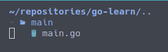

# Golang 的包策略

## 程序的入口

每门语言学习的时候第一件事一般都是编写 `Hello World` 程序

Golang 也不例外，但是 Golang 需要注意的是要留意其包策略

以下代码在执行时会报错 “package command-line-arguments is not a main package”

```go
package golearn

import "fmt"

func main() {
  fmt.Println("Hello world")
}
```

其原因在于，Golang 要求程序入口必须是 main 包下的 main() 函数，
因此此时可以考虑在该文件夹下创建一个 main 包，并在其中编写包含main()函数的 main.go


