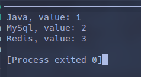
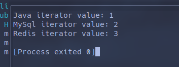
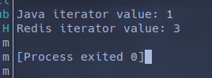

# HashMap 的遍历方法

HashMap 的遍历方法有多种，不同的 JDK 版本也会提供不同的写法

## Java8 之前的遍历

Java8 之前主要使用 EntrySet 和 KeySet 进行遍历：

### EntrySet

```java
// EntrySet遍历
public class HashInterator {
  public static void main(String[] args) {
    HashMap<String, String> map = new HashMap<>();
    map.put("Java", "1");
    map.put("MySql", "2");
    map.put("Redis", "3");

    for (Map.Entry<String, String> entry : map.entrySet()) {
      System.out.println(entry.getKey() + "," + entry.getValue());
    }
  }
}

```


### KeySet

KeySet 用以遍历 Key 内容，此时通过 `map.get(key)` 来获取 Value 值。
相较 EntrySet，KeySet 的性能由于其本质是遍历两次 map 而更低

```java
public class HashInterator {
  public static void main(String[] args) {
    HashMap<String, String> map = new HashMap<>();
    map.put("Java", "1");
    map.put("MySql", "2");
    map.put("Redis", "3");

    for (String key : map.keySet()) {
      System.out.println(key + ", value: " + map.get(key));
    }
  }
}

```



### KeySet 迭代器

还有一种方式是获取 KeySet 的迭代器用以遍历：

```java
    Iterator<String> iterator = map.keySet().iterator();
    while(iterator.hasNext()) {
      String key = iterator.next();
      System.out.println(key + " iterator value: " + map.get(key));
    }

```



迭代器的作用是用来动态操作当前 map（如增加或删除），java 禁止非迭代器的遍历修改操作

```java

    for (Map.Entry<String, String> entry : map.entrySet()) {
      if ("MySql".equals(entry.getKey())) {
        map.remove(entry.getKey());
        continue;
      }
      System.out.println(entry.getKey() + "," + entry.getValue());
    }

```


可以看出，当使用 Collections 自己的删除操作时会抛出 ConcurrentModificationException，
这是因为 `foreach` 语句本质上是调用 Collections 的 Iterator，使用 Iterator 的 `next()` 进行迭代，
以下为 Collections 的源码：

```java

final class EntryIterator extends HashMap<K, V>.HashIterator implements Iterator<Map.Entry<K, V>> {
    EntryIterator(HashMap this$0) {
        super();
    }

    public final Map.Entry<K, V> next() {
        return this.nextNode();
    }
}

final class ValueIterator extends HashMap<K, V>.HashIterator implements Iterator<V> {
    ValueIterator(HashMap this$0) {
        super();
    }

    public final V next() {
        return this.nextNode().value;
    }
}

final class KeyIterator extends HashMap<K, V>.HashIterator implements Iterator<K> {
    KeyIterator(HashMap this$0) {
        super();
    }

    public final K next() {
        return this.nextNode().key;
    }
}
```

此时再看 `nextNode()` 的代码：

```java

final Node<K, V> nextNode() {
    Node<K, V> e = this.next;
    if (HashMap.this.modCount != this.expectedModCount) {
        throw new ConcurrentModificationException();
    } else if (e == null) {
        throw new NoSuchElementException();
    } else {
        Node[] t;
        if ((this.next = (this.current = e).next) == null && (t = HashMap.this.table) != null) {
            while(this.index < t.length && (this.next = t[this.index++]) == null) {
            }
        }

        return e;
    }
}

```

可以发现，Iterator 的 `nextNode()` 方法是会对 expectedModCount 和 modCount 进行比对的，
这相当于是一个版本号机制，Iterator 在被初始化时会将其 expectedModCount 设定为集合的 modCount:

```java

final Node<K, V> nextNode() {
    Node<K, V> e = this.next;
    if (HashMap.this.modCount != this.expectedModCount) {
        throw new ConcurrentModificationException();
    } else if (e == null) {
        throw new NoSuchElementException();
    } else {
        Node[] t;
        if ((this.next = (this.current = e).next) == null && (t = HashMap.this.table) != null) {
            while(this.index < t.length && (this.next = t[this.index++]) == null) {
            }
        }

        return e;
    }
}
```

而 **集合** 的增删改操作则会修改 **集合** 的modCount，
因此使用集合的增删改操作会导致 Iterator 记录的 “版本号” 与集合的不一致，
从而抛出 `ConcurrentModificationException`:

```java
public boolean remove(Object key, Object value) {
    return this.removeNode(hash(key), key, value, true, true) != null;
}

final Node<K, V> removeNode(int hash, Object key, Object value, boolean matchValue, boolean movable) {
    // 其他代码
          ++this.modCount;
          --this.size;
          this.afterNodeRemoval((Node)node);
          return (Node)node;
      }
  }

  return null;
}
```

综上，若要动态地对 map 边遍历边修改，应使用 Iterator.remove()，
这时每次修改都会在最后更新 Iterator 的 expectedModCount:

```java
public final void remove() {
    Node<K, V> p = this.current;
    if (p == null) {
        throw new IllegalStateException();
    } else if (HashMap.this.modCount != this.expectedModCount) {
        throw new ConcurrentModificationException();
    } else {
        this.current = null;
        HashMap.this.removeNode(p.hash, p.key, (Object)null, false, false);
        this.expectedModCount = HashMap.this.modCount;
    }
}
```

此时，遍历代码为：

```java
Iterator<Map.Entry<String, String>> iterator = map.entrySet().iterator();
while(iterator.hasNext()) {
  Map.Entry<String, String> entry = iterator.next();
  if ("MySql".equals(entry.getKey())) {
    iterator.remove();
    continue;
  }
  System.out.println(entry.getKey() + " iterator value: " + entry.getValue());
}
```



## Java8 之后的遍历

### lambda 表达式

最常用的一种遍历，注意这种方式也不能动态修改 map

```java

    map.forEach((key, value) -> {
      System.out.println(key + ":" + value);
    });
```

### stream()

stream() 的作用是可以对元素视情况进行处理，一般不会用来修改原 map 或说集合，
而只会执行一段非增删改的逻辑，或使用元素内容排出新的集合

#### 单线程

```java
map.entrySet().stream().forEach((entry) -> {
  System.out.println(entry.getKey() + ": stream value" + entry.getValue());
});
```

#### 多线程

```java
map.entrySet().stream().parallel().forEach((entry) -> {
  System.out.println(entry.getKey() + ": stream value" + entry.getValue());
});
```

#### 排出的范例

```java
List<SubjectVO> result = subjectList.stream()
        .filter(item -> item.getParentId() == 0L)   // 找出根节点
        .map(item -> new SubjectVO(item.getId(), item.getTitle(), null))    // 每个 EduSubject 转换为 VO 类
        .peek(item -> item.setChildren(getChildrenList(item, subjectList))) // 找出子分类
        .collect(Collectors.toList());
```
