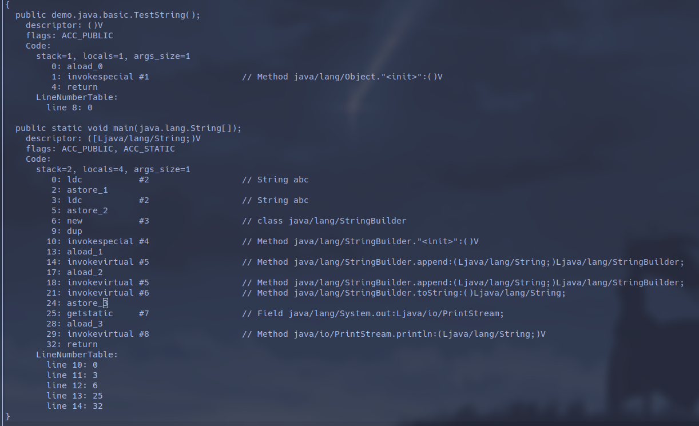

# 字符串的实现

Java 中使用字符串的方式有三种：String, StringBuilder, StringBuffer

## String

String 的使用很简单，需要注意的是 String 的内容的底层实现是一个 final 修饰的 char 数组，
因此 String 可以认为一旦声明就是不可变的，虽然 String 类中也有提供像 `concat()`, `replace()`
等方法用于 String 的操作，但这些方法的实现最终都是返回一个新的 String 对象：

```java
public String concat(String var1) {
    int var2 = var1.length();
    if (var2 == 0) {
        return this;
    } else {
        int var3 = this.value.length;
        char[] var4 = Arrays.copyOf(this.value, var3 + var2);
        var1.getChars(var4, var3);
        return new String(var4, true);
    }
}
```

所以直接使用 String 类的方法来操作 String 是低效的，这就需要用到 AbstractStringBuilder,
以及其子类 StringBuilder 和 StringBuffer

## AbstractStringBuilder

AbstractStringBuilder 的实现中，用于存储字符串内容的 char 数组不再被 final 修饰，
且其相关的字符串操作底层均使用本地方法实现，因此相较于 `String.concat()` 方法要更为高效

```java
public AbstractStringBuilder append(String var1) {
    if (var1 == null) {
        return this.appendNull();
    } else {
        int var2 = var1.length();
        this.ensureCapacityInternal(this.count + var2);
        var1.getChars(0, var2, this.value, this.count);
        this.count += var2;
        return this;
    }
}


public void getChars(int var1, int var2, char[] var3, int var4) {
    if (var1 < 0) {
        throw new StringIndexOutOfBoundsException(var1);
    } else if (var2 > this.value.length) {
        throw new StringIndexOutOfBoundsException(var2);
    } else if (var1 > var2) {
        throw new StringIndexOutOfBoundsException(var2 - var1);
    } else {
        System.arraycopy(this.value, var1, var3, var4, var2 - var1);
    }
}


public static native void arraycopy(Object var0, 
    int var1, 
    Object var2, 
    int var3, 
    int var4);

```

或许也因此，直接使用运算符进行的 String 拼接在编译为 class 文件之后可以看到是使用 `StringBuilder.append()`
实现的：

```java
public class TestString {
    public static void main(String[] args) {
        String s1 = "abc";
        String s2 = "abc";
        String s3 = s1 + s2;
        System.out.println(s3);
    }
}
```

上述文件可以通过 `javap -v $CLASSNAME` 来查看其执行过程：



由上图可见，直接使用运算符进行的字符串拼接调用的是 `StringBuilder.append()` 方法，但是这种调用并不高效：
JVM 会先声明一个空的 StringBuilder，然后再将 s1, s2 逐个 `append()` 进去，而如果我们直接使用 StringBuilder
拼接 s1, s2 则完全可以在 StringBuilder 初始化的时候传入其中一个值从而降低运行成本

### StringBuffer

StringBuffer 是 StringBuilder 的线程安全实现，其源码中大部分方法都加上了 `synchronized` 关键字，
包括 `toSting()` 方法，这意味着一个线程取得 StringBuffer 的操作权时其他欲使用 StringBuffer 的线程会被阻塞

这种实现能保证 StringBuffer 的内容一致性，但自然也会带来一定的性能开销，于是 StringBuffer 为 `toString()`
方法设置了缓存：

```java
public synchronized String toString() {
    if (this.toStringCache == null) {
        this.toStringCache = Arrays.copyOfRange(this.value, 0, this.count);
    }

    return new String(this.toStringCache, true);
}

private transient char[] toStringCache;
```

transient 关键字修饰的缓存意味着它不会在 StringBuffer 序列化时被囊括在内，同时因为其它操作方法都会刷新缓存，
StringBuffer 能保证在 StringBuffer 不被修改时是安全的

留意上面源码中的 `return new String(this.toStringCache, true);`，这是 StringBuffer 和
StringBuilder 的 `toString()` 的最大不同，该方法以布尔值为重载符号，以最小成本完成 String 的初始化：

```java
String(char[] var1, boolean var2) {
    this.value = var1;
}
```

而 StringBuilder 的 `toString()` 调用的 String 构造方法则为：

```java
public String(char[] var1, int var2, int var3) {
    if (var2 < 0) {
        throw new StringIndexOutOfBoundsException(var2);
    } else {
        if (var3 <= 0) {
            if (var3 < 0) {
                throw new StringIndexOutOfBoundsException(var3);
            }

            if (var2 <= var1.length) {
                this.value = "".value;
                return;
            }
        }

        if (var2 > var1.length - var3) {
            throw new StringIndexOutOfBoundsException(var2 + var3);
        } else {
            this.value = Arrays.copyOfRange(var1, var2, var2 + var3);
        }
    }
}
```

相比之下 StringBuffer 利用缓存时使用的 String 构造函数功能更少而成本更小
