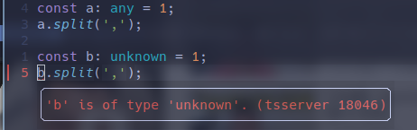
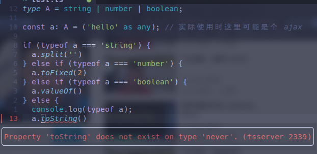

# any 和 unknown 和 never

## any

any 即通用数据类型，它可以是涵盖了所有数据类型的集合，
因此假如数据是 number，它也可以调用 `string.split()` 方法

## unknown

unknown 为赋值时尚不清楚数据类型的情况服务，它也可以涵盖所有的数据类型，
但与 any 不同的是，ts 会检查 unknown 的对象是否在 unknown 的状态下调用了确定类型的方法并发出警告



使用 unknown 类型接收数据之后应使用断言进行类型转换：

```typescript
const b: unknown = 'test, temp';
const c = b as string;
c.split(',');
```

## never

never 相当于空集，表示永不存在值的类型，常用于构造条件类型来组合出更灵活的推断


