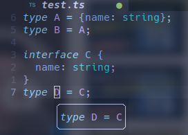

# type & interface 区别

## type

type 又称*类型别名*，其本质上是给所定义的类型去别名，
大多数场合下都可以使用 type

> typescript 中的每一个类型都是一个集合，
像 `type A = 0` 里的 0 表示的是仅有0一个值的集合，
由此类推 `type falseLike = false | null | '' | undefined`，
则是表示 falseLike 是将包含后面几个仅有一个值的集合的集合作为一种类型;
而 `type Person = { name: string; age: number }`
则是表示将包含 name, age 两个字段的对象集合命名为 Person 类型

## interface

接口的概念源自面向对象编程;
typescript 中的 interface 用以声明接口，描述**对象的属性**，
interface 和给对象取别名时的 type 还是类似的，以下代码中两种 `Paper` 实现是一致的：

```typescript
interface Paper extends Array<string>, Article {
  id: number;
  field: string;
}

interface Article {
  wordCount: number;
}

type PaperInType = Array<string> & {
  id: number;
  field: string;
} & Article;
```

## 区别

### 1. 范围不同

就像上面说到的那样，interface 只能描述 **对象**，而 type 则可描述所有数据，
因此它不能像 type 那样仅用 string, number 等类型的某些值组装类型

### 2. 描述的性质不同

type 只是取别名，而 interface 则是类型**声明**，
经过 interface 声明的类型是真实存在的，而 type 往往还会被 lsp 转换为原始结构
不过这点在使用上体验差距不大




### 3. type 不可重新赋值，而 interface 可以进行自动合并

不可重新赋值既是 type 的优点，也是 type 的缺点

不可重新赋值使 type 在编译的时候有更高的性能，
同时避免其在使用时出现二义性，但也使其拓展性降低

与之相反的是，typescript 可以通过声明同名接口来为该接口添加新的属性

```typescript
interface ForExpand {
  name: string;
  age: number;
}

// 可以出现在不同的文件中
interface ForExpand {
  expanded: boolean;
  sex?: number
}

const a: ForExpand = {
  name: 'name',
  age: 18,
  expanded: false
}
```

实际应用上便可通过这个特性来方便地封装一些模块的代码：

```typescript
import {InterfaceWaitForExpand} from 'module';

declare module 'module' {
  // 指定只拓展 module 模块的内容
  export interface InterfaceWaitForExpand {
    // 这里输出定义了两个字段到 InterfaceWaitForExpand 接口中
    // ts 会将这两个字段合并到 module 中的 InterfaceWaitForExpand 接口
    _field1: boolean;
    _field2: string;
  }
}
```

若想扩展全局的接口则可以使用 `declare globle`

```typescript
declare global {
  interface String {
    padZero(length: number): string;
  }
}
```

因此，**对外 api 尽量使用 interface，方便扩展；对内 api 尽量使用 type，防止代码分散**
