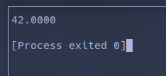
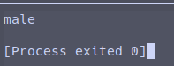

# TS 中的数据类型(Datatype)

## 数据类型种类

TS 的数据类型种类主要有两种：来自 JS 的数据类型和来自 TS 自身的数据类型

### 来自 JS 的数据类型

null, undefined, string, number, boolean, bigint, symbol,
object (含 Array, Function, Date, RegExp...)

### TS 自己的数据类型

void, never, enum, unknown, any,
自定义类型：type, interface

## TS 的包装对象

像 java 一样，TS 也有包装类的说法

TS 的包装类一般包含以下方法：

1. 字符串转换：`toString()`, `toLocaleString()`, 后者根据运行环境决定 String 的实现
2. 表示方法/精度转换：指数式显式 `toExponential()`，
位数指定 `toPrecision()`，小数位位数指定 `toFixed()`
3. ValueOf() 方法

实际使用时一般不会显式地用到包装类，但每个基本数据类型都可通过调用上述包装类的方法来使用包装类，
此时 TS 会隐式地将变量转换为对应的包装类并执行逻辑:

```typescript
var a = new Number(42);
console.log(a.toFixed(4));
```



上述代码的执行逻辑如下：

1. 声明一个临时的包装类对象 `let temp = new Number(42)`
2. 对 a 进行赋值 `a = temp.toFixed(4)`
3. 删除 temp

## 用类型签名和 Record 描述对象

虽然 TS 有 Object 类型，但因为 Object 类型的范围太大，
这会使得数据类型的描述过于宽泛，所以一般不会使用 Object 来描述对象的数据类型

此时一般使用以下方法描述对象的数据类型：

1. class/ constructor, 这种方式对于 TS 来说有些死板，用的人不多
2. type / interface

```typescript

type Person = {
  name: string;
  age: number;
};

const a: Person = {
  name: 'Lloyd',
  age: 18,
};
```

### 索引签名

通过索引签名可以指定一个数据类型为 key value 结构，同时让它可以拥有拓展的属性数量
并指定其中 key 和 value 的数据类型，key 可以是 string, symbol 和 number 类型

> symbol 的使用场景非常少

声明索引签名之后，与 key 为同类型的字段名，其值的类型必须与签名的 value 的类型一致,
当 key 是 string 类型时，由于本身就使用 string 类型作为字段索引，就算字段名是数字也会被解释为 string，
所以此时数据结构的各字段必须遵循该签名结构

> 下列代码中，name 字段和 email 字段可以限定此签名的数据结构必须包含这两个索引

```typescript

type Person = {
  [k: string]: string;
  name: string;
  email: string;
};

type Person2 = Record<string, string> // 和Person是类似的，但没有对name, email的存在性约束

const a: Person = {
  name: 'Lloyd',
  email: 'aaa@mail.com',
  sex: 'male',
};

console.log(a['sex']);
```



另需注意区分 `[k: string]: {value: string}` 和 `[k: string]: string`,
前者表示数据签名限定索引为 string 类型，值为包含 string 类型的 value 字段的 object,
而后者表示数据签名限定索引为 string 类型，值为 string 类型

## 使用泛型描述数组

由于直接使用 `type A: Array` 太不精确，TS 要求使用 `Array<T>`, `T[]`
或 `[T1, T2, ...]` 来表述数组

以下两个类型等价：

```typescript
type A = string[];
type B = Array<string>
```

## 元组

以下类型分别为二元组和三元组

```typescript
type A = [string, string]
type B = [string, string, number]

type C = [1, 2, 3 | 4] // 这里指数组的前两个元分别数据类型是限定为1, 2的两个集合，第三个元是包含3, 4的集合
const c: C = [1, 2, 4]
```

## 函数对象

```typescript

type FnReturnVoid = () => void;
const f1: FnReturnVoid = () => {
  console.log('h1');
};


// this的用法
type Person = {
  name: string;
  age: number;
  sayHi: FnWithThis;
};

type FnWithThis = (this: Person, msg: string) => void;

// 箭头函数不支持this
const sayHi: FnWithThis = function (msg) {
  console.log(this.name + ' ' + msg);
};

const a: Person = {
  name: 'Lloyd',
  age: 18,
  sayHi: sayHi,
};

a.sayHi('Hello');
```
