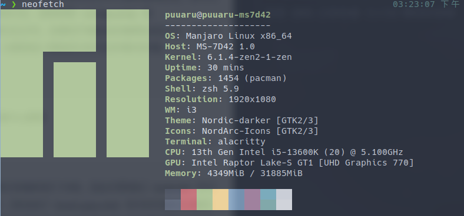
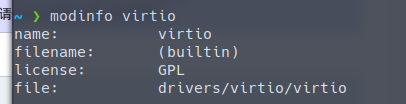

# Linux 下使用 KVM 的笔记

出于工作流需求决定使用主 Linux + kvm Windows 虚拟机的方式使用双系统

以下是使用 KVM 遇到的一些问题和笔记

## 安装环境



## VirtIO 模块的装载

安装 QEMU 之前检查 VirtIO 模块的装载:

```bash
$lsmod | grep virtio  # 若无显示则运行下一条命令
$sudo modprobe virtio
```

然而实际上，像安装环境提到的Zen等一些内核会把 VirtIO 直接编译进内核，
因此无需通过 `modprobe` 命令进行加载，并且 `lsmod | grep virtio`
可能也会因为 VirtIO 是存在于内核中而不是以可加载的模块的形式存在在系统中的，
你可以通过命令 `modinfo virtio` 查看 VirtIO 的情况：


