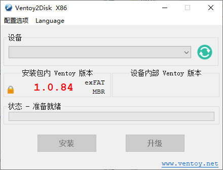
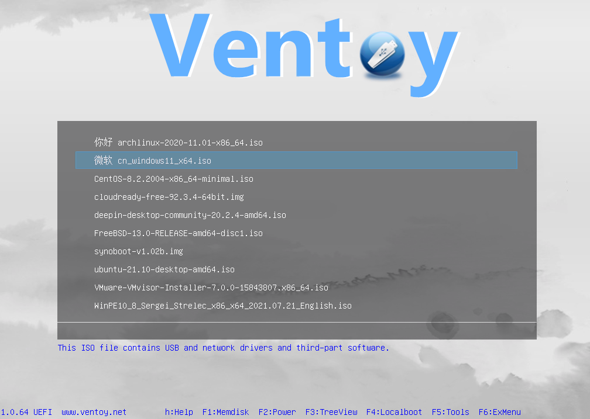

# 制作可启动U盘

装机时，操作系统的安装一般以存有系统镜像的可启动U盘完成。

## UltraISO

比较传统的装机方式。

使用 UltraISO 将下载好的镜像置入U盘，并顺便完成引导设置，这种方式就像是过去使用的光盘装机，此时U盘充当系统安装光盘的作用，因此每个U盘只能存放一个系统镜像。

## Ventoy

Ventoy 是一个用以制作可启动U盘的工具，它可以使单个U盘在其存放能力允许的情况下存放多个系统镜像，并在装机时供用户选择。

你只需在[官网](https://www.ventoy.net/cn/download.html)上根据提示获取并解压即可使用。

### 使用

1. 首先你需要将你的U盘格式化为装机盘，因此请务必确保所U盘内而数据已安全备份。
2. 接着，你只需要打开 Ventoy2Disk，选择你的U盘并点击安装即可完成启动盘

3. 将你的镜像文件复制到U盘中，此时你的U盘便可安装对应的镜像，你只需要在启动时选择对应的镜像即可

### 使用本地镜像

部分情况下，你可能使用的是系统盘+存储盘的策略，此时你若需要装机一般只需动系统盘即可。这种情况下你可以选择为你的U盘和本地盘中的镜像建立 vlink ，此时使用 VentoyVlnk 即可